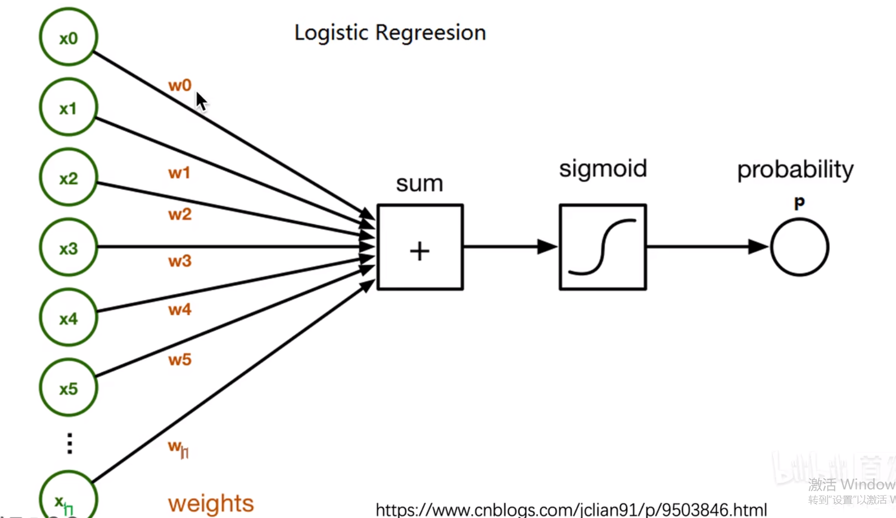
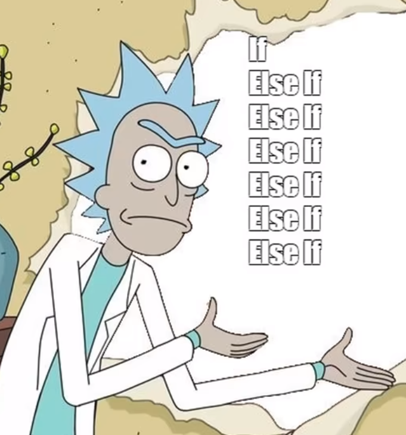
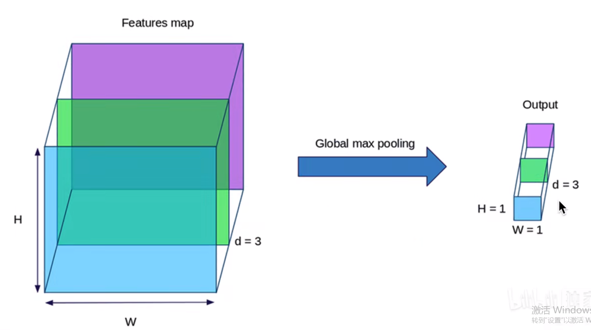
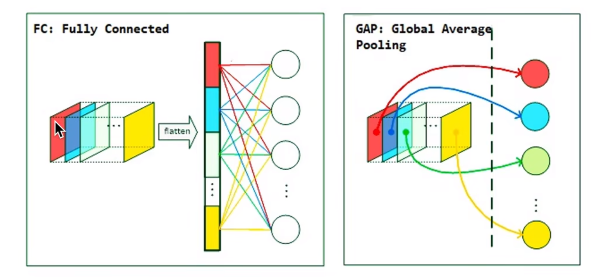
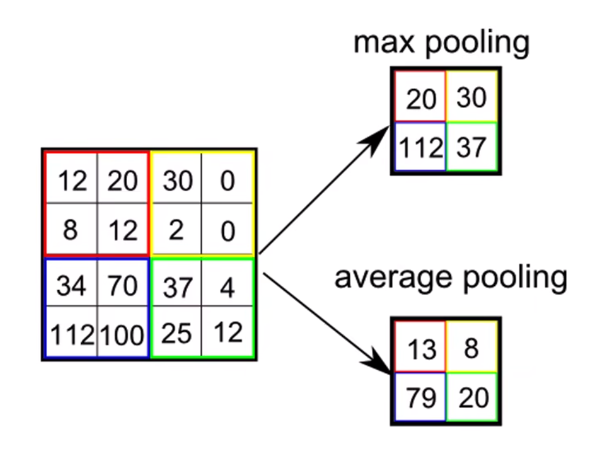

# 可解释性机器学习

## 学习参考

本片笔记的输出是参考b站知名up主[同济子豪兄的可解释性机器学习公开课](https://space.bilibili.com/1900783/channel/collectiondetail?sid=713364)教学。

另外有关李宏毅的可解释性的讲解在我另一个笔记中：[点击跳转](https://github.com/lyc686/LiHongyi-2021-ML/blob/main/notes/07%E3%80%81%E5%8F%AF%E8%A7%A3%E9%87%8A%E6%80%A7%E6%9C%BA%E5%99%A8%E5%AD%A6%E4%B9%A0.md)

## 一、为什么要引入可解释性学习

下图所示的是一个**诺曼底登陆**中判断真假坦克的故事的各种版本的合集，故事中使用了**神经网络模型**来训练，并且在训练集上准确率达到了99%但是实际测试的时候却非常差，有一个版本说的是，这个现象是由于训练的时候真的坦克都是晴天拍的，假的坦克都是在阴天拍的。所以由于这种数据不是**同分布**的情况导致了，模型并没有学到有关坦克的信息，而是只学到了天气的信息。

现在的机器学习都是基于**统计**的学习，也就是对于大量的数据产生我们最终的分类边界 / 预测曲线。但是最终这个边界/曲线是如何而来的我们并不知道，并且当网络在高维的非凸空间进行训练，模型的深度逐渐加大，参数逐渐增多，这个边界最后是什么我们也不知道。----**`黑箱子`**

下面几张图片展示的就是，人工智能AI的**知其然而不知其所以然**的例子，同样也告诉了我们可解释性的重要意义。

* 图一：ai绘画的发展迅速

* 图二：将三文鱼放入水中，真就把三文鱼放入水中。

* 图三：握手，但是好像不是真的人的手。

可解释性学习的优势：

使用可解释性学习对`YOLO`的模型进行分析：

### 2.一些比较好的研究

#### （1）从ML(Machine learning)到MT(Machine teaching)

通过可解释性学习让人们去学到机器为什么要作这些判断的一些知识。也就是向人类展示ai的脑回路

比如应用在图像分类，下围棋，复原山水画，书法作品的点评等等

#### （2）进行一些细粒度的判断

由于人眼无法直接观测到一些比较小的差异，所以我们可以通过一些可解释性来帮助人们理解为什么ai将图片做如下分类。

#### （3）前沿AI方向

* chatgpt聊天机器人（完全就是黑箱子，很适合我们做可解释性分析）

* AI绘画，关键点检测等需要较深的大模型的应用

### 3.研究思路

#### （1）选取本身就有较好可解释性的机器学习算法

例如：KNN算法、logistic逻辑回归、线性回归等都是非常易于理解的。

**最好的可解释性：`If-else`**非常符合人脑的判断过程。机器学习中的**决策树**也是同一个道理，对于人类来说相当容易理解决策过程。

同样**朴素贝叶斯算法**也是我们只要学过这个统计学方法就能理解的。

#### （2）传统机器学习的可解释性分析

传统的机器学习算法我们同样也可以做一些可解释性分析，如下图所示：

下图所示的是一些可视化的图

* 图一是随机森林下的特征的重要性
* 图二是用不同的颜色表示出不同特征的重要性
* 图三是特征按列存放，加入随机打乱某一个特征，观察训练结果（1、变差说明这个特征重要。2、没影响说明这个特征可有可无。3、变好说明这是个噪声特征。）
* 图四是PDP图表示的是随着年龄的增长，不同的人患心脏病的概率
* 后面也是等等的一些可视化方法

#### （3）可解释性与拟合能力

用一张图解释如下图所示，横轴表示可解释性，纵轴表示拟合能力。

其他的一些可解释性的角度。

### 4.深度学习的可解释性

由于深度学习是由于一层一层的神经元构成的深度网络，所以可解释性是很差的。

如下图所示，做手写数字识别的时候，最开始的卷积层和下采样层还能看出来一点，但是到了后面的卷积层和全连接层我们就看不懂了。所以可解释性在深度学习领域是非常必要的。

## 二、卷积神经网络可解释性分析

### 1.常见可解释性领域

如下图所示的是我们在卷积神经网络中比较常见的一些可解释性分析的方法，其他的方法可以具体问题具体分析。

#### （1）可视化卷积核

卷积神经网络的实质就是卷积核在图像上滑动，从原图中根据卷积核提取特征，而卷积核是通过大量的训练得到的。

不同的卷积核提取的特征也是不同的，往往是越来越复杂，越来越特化，越来越有语义。

比如12年火爆的Alexnet的模型，他的第一层就是提取的各种信息，有的是特定角度，有的是颜色，有的是结构。

而深层的卷积核由于通道数变多，我们无法直接画出来，所以我们一般只能画出来第一层的卷积核。

但是我们可以通过一些简介的方法进行可视化来观察图像中的哪一部分比较重要，比如**遮挡、缩放、平移、旋转**

#### （2）遮挡、缩放、平移、旋转

#### （3）找到能使某个神经元激活的原图像素或者小图

通过**反卷积**的操作，我们可以看到每一层的每一个神经元关注的是哪一部分特征。

我们也可以发现层数越深他关注的信息更加具体，更加具有语义的特性。

同时也给出了一篇**目标检测RCNN**的必读论文

#### （4）基于类激活热力图（CAM）的可视化

也就是让人工智能将他认为重要的区域以热力图的形式高亮的显示出来。

同一张图的不同类别的热力图是不同的。

CAM的一些论文

不同的CAM的方法，最终给的效果是大同小异的，但是可能在具体特定的应用场景下效果可能不同，比如在多目标的场景下。

同理，可解释性分析也可以帮助我们分析模型为什么会犯错，如下图所示的，在经过不同的卷积层之后由于关注区域的变化导致预测结果也发生了变化。

#### （5）可视化语义特征

由于最后经过全连接层之后的结果是一个很高维的向量，而这个向量中包含的是语义的特征，所以我们可以使用一些降维的方法将其展示在二维平面上，可视化出数据集中语义的特征。

#### （5）生成某些满足要求的图像

比如我们随机生成一个图片，不断地去迭代，让他判断是一个哈士奇的概率最大，最终我们发现确实有哈士奇的感觉。

或者添加一些**噪声**使得模型指鹿为马，

有关黑白盒攻击就属于网络安全的领域了，可以看我写的李宏毅机器学习笔记的第八部分进行复习。

## 三、CAM可解释性分析算法

### 1.CAM经典论文

这篇论文是CAM可解释性的非常经典的论文，一般都需要去阅读一下。

我们除了可以得到预测类别，同时还能够看到模型的**关注点**是哪些地方。

同时对于同一张图片，**不同的预测类别标记**，也会有不同的关注点，下图所示的热力图可以很清晰的看到。

### 2.CAM算法的精妙之处

### 3.CAM类激活热力图原理

#### （1）算法原理

CAM可解释性分析其实就是用的类激活热力图，原理如下图所示，我们在**最后一层**卷积层上，将后续的全连接层替换为一个**`GAP`**层，GAP层就是，对于最后一层的卷积每一个channel求一个**平均值**作为GAP的一项，假设最后一层卷积之后有512个channel那么GAP中就有512个平均值。每一个平均值对应这个channel（特征），然后使用这些平均值去做预测求得分类的**分数logit**，其中的每一个平均值对应的**权值w**表示的就是这个特征的重要程度。然后使用每一个特征的权重w去和最后一层卷积的channel做乘法再相加，最后就可以得到**CAM类激活热力图**。这是因为，在最后一层的卷积层的各个channel中其实都是保存有**位置信息**的，再根据GAPD得到的权重自然就可以得到最终的热力图，最后假设是下图中的例子，最后一层的分辨率为14*14放到原图上之前还需要**放缩**一下分辨率。

下图就是一个简单的例子解释假设最后一层卷积有3个channel然后使用GAP变成三个平均值。

#### （2）CAM算法用GAP替换传统全连接层

GAP取代全连接层可以总结为以下几点：

* 减少参数两、防止过拟合
* 每个GAP平均值代表了卷积层最后一层输出的每一个channel，如果使用全连接层而不是用GAP的话无法计算每个channel的权重。
* 如果没有GAP层，需要把全连接层替换为GAP层，再重新训练模型。

下面两张图所示的都是传统**全连接层**和**GAP**的区别，而且我们要想使用CAM热力图的可视化就必须将最后的全连接层**替换**为GAP

#### （3）CAM算法的缺点

CAM算法的**缺点**：

* 必须有GAP层，否则得修改模型结构之后重新训练
* 只能分析**最后一层**卷积层输出，无法分析中层。

### 4.池化

池化其实就是一个在卷积神经网络中很简单的概念，目的是**减少计算量**、**防止过拟合**、以及保持一定的**平移不变性**。

下图所示的就是一个人脸的图片，两张图片的位置是不同的，但是由于池化的存在使得，判断特征为眼镜的卷积核最后的输出结果是一样的。

但是存在的问题就是，池化使得我们不知道眼睛这个特征在原图中的**具体位置**。

所以，一般不用池化

### 5.Grad-CAM

Grad-CAM的提出就是基于之前的CAM最后必须是GAP层以及只能处理最后一层卷积层的问题，提出的一种解决方案。

解决方案如下图所示（两张图是一个意思）：

* 首先，网络进行正向传播，对卷积过程中得到的某一**特征层A **的Feature Map（一般指的是最后一个卷积层的输出）和**预测值y**（注意，这里指的是softmax激活之前的数值）。
* 假设我们想看下网络针对Tiger Cat这个类别的感兴趣区域，假设网络针对Tiger Cat类别的预测值为yc 。
* 接着对yc 进行**反向传播（求梯度）**，能够得到反传回特征层A的梯度信息Aˊ 。
* 最后，通过计算得到针对特征层A每个通道的**重要程度**，然后进行**加权求和**再通过**ReLU**激活函数就行了，最终得到的结果即是Grad-CAM。

也可以说Grad-CAM更具一般性

使用了Grad-CAM算法之后，我们就不需要最后一定是一个GAP层，而且可以对任意特征层进行反向传播查看热力图信息，来观察模型在这一层关注点在哪里。

### 6.outputs1000channel-GAP

最后一层卷积层输出1000个channel，目的是在应用于ImageNet的1000分类数据集上时，最后**不需要GAP后面那一步讨论权重的步骤**，直接每一个channel取平均之后，放入softmax层获取分类的logit分数，然后用分数去和最后一层卷积层的各自channel去相乘再相加得到最终的CAM类激活热力图。

推广到一般就是让模型最后一层卷积的输出channel数 = 类别数

### 7.Machine Teaching

正如上面这篇论文提到的，让模型来教会我们这些不是鸟类爱好者的人来识别不同的鸟类。我们可以通过可解释性的学习，来获取到模型在做鸟类识别的时候都关注与哪些部分的特征，让模型来教会我们如何去识别一个鸟类，这就是**Machine Teaching**的精髓所在。

## 四、CAM可解释性论文精读分析

本次学习的论文精度就是上一节提到的CAM的经典论文：`Learning Deep Features for Discriminative Localization`

## 五、Grad-CAM深度学习可解释性分析

## 六、Grad-CAM论文精读分析

## 七、LIME机器学习可解释性分析

## 八、LIME论文精读分析

## 九、MATLAB深度学习可解释性分析

## 十、神经网络科研绘图可视化工具

## 可解释性小结

### 1.可解释性知识总结

### 2.可解释性学习笔记

有关图像分类的可解释性分析，在datawhale组队学习的图像分类部分的笔记中有展示，可以去复习一下。

有关pytorch图像可解释性分析的库：https://github.co,/utkuozbulak/pytorch-cnn-visualizations，包含了各种各样的可解释性的方法。

### 3.思考题

## 学习建议

### 1.研究方向

1. 考虑到未来招工作的实际需求，我们的研究方向应该是和比较火的各个方向都有交叉的**通用**方向。比如和计算机视觉，自然语言处理，推荐系统等都有交叉。

2. 人工智能的未来方向一定是**越来越深，参数量越来越大**，所以可解释性是很重要的。
3. 数据集可以找导师问一问。
4. ~ 6.都是可解释性学习的优点。

